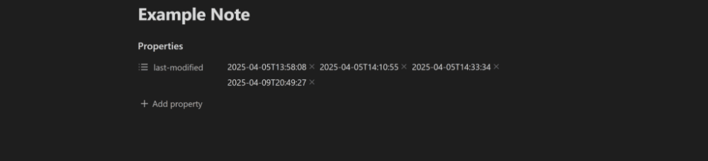
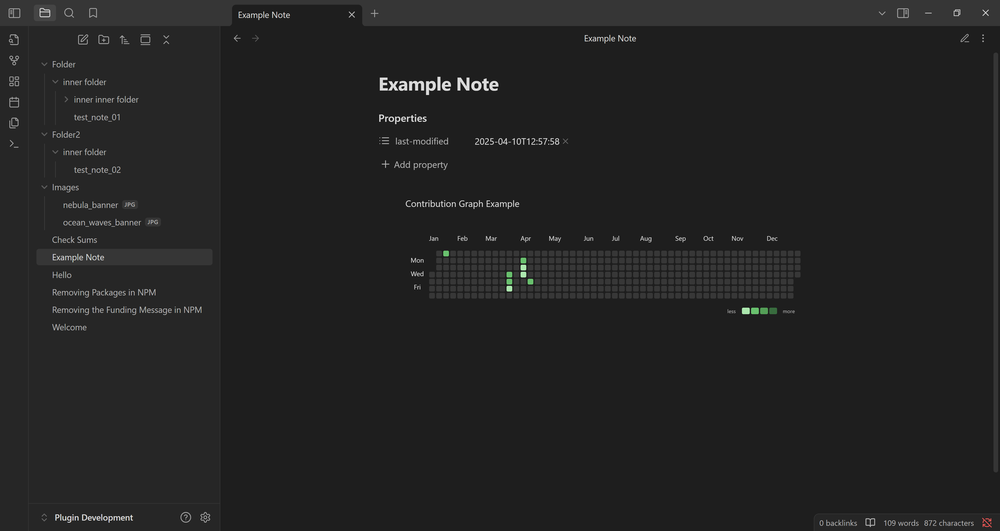

# Log Keeper

<a href="https://github.com/JimJamBimBam/obsidian-note-modification-tracker/releases/latest"></a>
<a>
</a>

Track changes to your notes within your [Obsidian Vault](https://obsidian.md/) as you type. When the content of a note changes within a vault, a new time stamp is generated or an original time stamp is edited, depending on the settings. This log is then added to a note's YAML property.


*Example of the 'last-modified' property seen in Obsidian.*

All time stamps are formatted according to the [ISO 8601](https://en.wikipedia.org/wiki/ISO_8601) standard format `YYYY-MM-DDTHH:mm:ss` where:

- **YYYY**: Is the current year (e.g. "2025" for the current year)
- **MM**: Is the current month (e.g. "04" for the 4th month)
- **DD**: Is the current day (e.g. "05" for the 5th day of the month)
- **T**: Separates the date and time values
- **HH**: Is the current hour from 0-23
- **mm**: Is the current minute from 0-59
- **ss**: Is the current second from 0-59


*Example of the 'last-modified' property being updated in a note when the Log Keeper plugin is enabled.*

## Uses

#### Contribution Graph / Dataview

Combine Note Modification Tracker with other plugins such as [Dataview](https://github.com/blacksmithgu/obsidian-dataview) and [Contribution Graph](https://github.com/vran-dev/obsidian-contribution-graph?tab=readme-ov-file) to create a contribution graph like in Github.


    
The snippet of javascript code can display a contribution graph from all the notes that contain a 'last-modified' property.
Note: To make it work, remember to replace 'js' with 'dataviewjs' at the start of the code block.

```
    ```js
    // code goes here...
    ```
```

Becomes:

```
    ```dataviewjs
    // code goes here...
    ```
```

### Code Snippet

```js
const currentYear = new Date().getFullYear()
const from = currentYear + '-01-01'
const to = currentYear + '-12-31'
let data = []
let dates = []

// Must collect all the files that have data on file modification
let pages = dv.pages()
	.where(p => p["last-modified"])

// Grab all the dates, even duplicates, and push to an array.
for (let i = 0; i < pages.length; i++) {
	let page = pages[i]
	for (let j = 0; j < page["last-modified"].length; j++) {
		dates.push(page["last-modified"][j])
	}
}

// Reduce the array down to a key value pairs.
// Key is the date with the time component removed and,
// value is the number of times the key appears in the array.
let dateCount = dates.reduce((acc, date) => {
	let dateKey = date.toString().split("T")[0]

	acc[dateKey] = (acc[dateKey] || 0) + 1

	return acc
}, {})

// We manipulate the key value pairs so that they 
data = Object.keys(dateCount).map(key => 
	({
		date: key,
		value: dateCount[key]
	}))
	
const calendarData = {
    title:  "Contribution Graph Example", // graph title
    data: data, // data
    fromDate: from, // from date, yyyy-MM-dd
    toDate: to // to date, yyyy-MM-dd
}
renderContributionGraph(this.container, calendarData)
```

## Contributing

Feel free to contribute to this plugin however you want. Bug reports, bug fixes and feature requests are always welcome.

## Goals

Listed in level of priority:

#### Plugin

- [ ] Add setting that allows users to format the time stamps of their notes using valid [Momentjs](https://momentjs.com/docs/#/displaying/format/) syntax.
- [ ] Add commands to temporarily suspend time stamping if the user needs to make changes to the properties of a note, to avoid excessive updates. Time stamping will resume after a note is closed, or the command is called again.
- [ ] Add setting that allows users to change the property name used for storing time stamps.
- [ ] Add a command that allows users to change the property name that is used to track changes. For example, changing "last-modified" to "log date".

#### Github Repo

- [ ] Add a CONTRIBUTORS.md file for anyone that has contributed to repo.
- [ ] Add Github action that automatically adds contributors to CONTRIBUTORS.md file.
- [ ] Add CONTRIBUTOR.md file reference to README.md file.